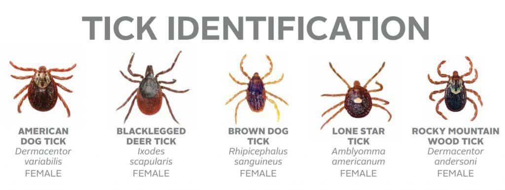
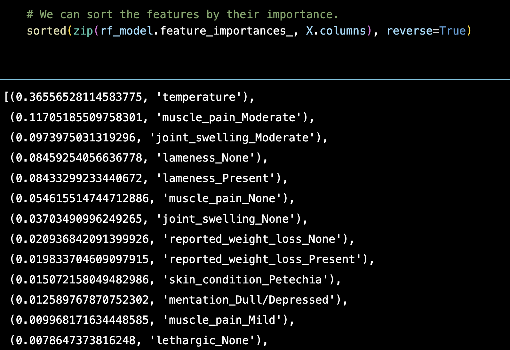

# UNC_Analytics_Bootcamp_Capstone_2022
## Exploratory analysis of tick-borne illness in dogs

### Purpose
In this project, we explore data related to the geographic distribution and prevalence of tick species which carry pathogens that cause illness/disease in the US. We also investigate veterinary data pertaining to symptom records and tick-borne illness testing. The goal of this study is to develop a model that could potentially predict the likelihood of a tick-borne illness before testing by analyzing the symptoms and ascertain whether there is a relationship between the recently recorded new migrations of ticks across the United States, and a higher number of tick-borne illness cases in dogs. 

- Questions the team hopes to answer with the data analysis:
    - Has the population of ticks increased within the United States?
    - Can Machine-Learning be utilized to effectively predict a tick-borne illness diagnosis?
    - Are any symptoms in particular better indicators for potential tick-borne illness?
    

### Overview
1. Collect geographical data on tick species and veterinary data on tick-borne illness testing and diagnoses
2. Create a shared database to store data 
3. Use machine learning algorithms to make predictions based on data
4. Run statistical analysis on data
5. Create visualizations to display tick data and machine learning results

### Technologies Utilized
- Excel
    - VBA
- PostgreSQL
- Amazon AWS
- Google Colab
    - Pandas and Scikit-Learn packages primarily
- R
- Tableau

(The requirements file has been created in order to import all the libraries and dependencies for this project located in the project root directory: [Requirements file](https://github.com/jobloom79/UNC_Analytics_Bootcamp_Capstone_2022/blob/customer_acceptance_test/requirements.txt))

### Communication Protocols
The communication protocols selected are 'Slack' and 'Zoom' meetings; a Kanban board was used to track issues as we progressed to stay on task. 

### Data Sources
- Tick data sourced from the [CDC](https://www.cdc.gov/ticks/surveillance/TickSurveillanceData.html)
- Pet data sourced from a combination of [animal shelter data in TX](https://data.world/cityofaustin/9t4d-g238), various webpages detailing signs/symptoms of tick-borne illness in dogs, and some prior knowledge of veterinary practices.
    

### Data Exploration and Database Utilization
We began our data exploration with three types of csv files:
- Tick surveillance datasets
- Animal shelter intake datasets
- Animal symptoms dataset

We started the data process by inspecting all the data ( categorizing the columns) and creating a ERD which we used to create and join our datasets into usable tables.

.png)

The CSV files were imported into a database on PgAdmin, hosted on an Amazon AWS server, and aligned to a single table on the FIPSCode and State ids. Then, the tables were filtered to clean the data, which included removing columns from the tick data (data source) and the animal data (breed, color, and name). These tables could then be used in training the models in machine learning. The tick tables were father manipulated - differentiated by year - to create concise visualizations of tick migration in tableau.

### Machine Learning Model 
We tested both supervised and unsupervised algorithms to predict Negative vs. Positive test results. Our motivation for choosing the models that we did stem primarily from the type of data we had - specifically in the supervised models. The benefits of using the oversampling methods are that they are able to address imbalances in the data. Our data has more negative test results than positive - which reflects the frequencies seen in the real world - and so if we were to run our model without resampling, it would be biased towards the negative results and not be good at predicting positives. We decided against using undersampling models to prevent losing potentially important information. The RandomForest model is also a good model to use with imbalanced data and large datasets. For unsupervised learning, our primary goal was not only to make predictions and group the data points, but to use as a method to explore the data further.

The datasets were loaded into Google Colab through a connection to the SQL database server. Once loaded, the data in table was cleaned further - removing columns that do not contribute to the model, changing some columns to have consistent units, changing columns to only include continuous data (converting categorical data using the get_dummies method), and finally scaling the data. 

By removing certain rows from the data and changing their data types accordingly, we create the features for the models - those features being the symptoms.

#### Results:
_**Supervised**_

The features for these models were the symptoms columns in the data, and the Target was defined to be the test result (i.e., Negative or Positive). Within the data, we see many more negative tests than positive test, therefore the data is resampled and scaled for each model. Additionally, the data is split 75%-25% between the training and testing sets, as is default with the scikit-learn `train-test-split()` function.

*Naive Random Oversampling*

After the steps detailed previously are completed, we then were able to feed the data to the model from our training set and then have it make predictions for our test set. This model produced a balanced accuracy score of 0.956 (96.5%). Below depicts the confusion matrix and classification table from this model.

We see here that the precision and sensitivity scores from this model are also remarkably high.

*SMOTE Oversampling*

For the SMOTE model, we ran the same preprocessing steps and received a balanced accuracy score of 0.949 (95%). Below we show the confusion matrix and classification table.

Again, we have garnered exceedingly high precision and recall scores from this model.

*RandomForest*

Again, we followed similar preprocessing steps before running this model. We received an accuracy score of 1.0 (100%) and the confusion matrix and classification tables are shown below.

|           |          |
|-----------|----------|
|||

Additionally, with the RandomForest model, we were able to calculate the features' importance scores, as shown below.

Here we see that of all the features, Temperature was ranked highest at 0.366 (37%).

_**Unsupervised**_

The features for the model were created slightly differently for this model. In our original dataset, we had three outcomes in the tested column: Negative, Positive, and Not Tested. For this model, we filtered our data to only include the 'Not Tested' patients and then created our features table from their symptom reports.

*KMeans*

For this model, we first needed to calculate principal components. It was decided to use three principal components, so the data was scaled and reduced accordingly. 

With these principal components, we decide to first generate an elbow curve. Although one of the initial goals was to have the model classify the data into two clusters, we wanted to see what the data suggested as the `k` value. The curve is depicted below

It is unclear where to define the elbow on this curve, but we determined it to be `k = 5`. As such, we decided to evaluate both two clusters and five clusters with the model. The model generated predictions for both cases and then we plotted these predictions into a 3D plot.

### Statistical Analysis
We endeavored to include statistical analysis on the features as well. However, due to time constraints, we were not able to fully delve into this area as far as we needed to. Below, however, displays the results from the analysis we were able to run.

We ran a general logistic regression model in R to see how well each feature is of a predictor for our target and garnered these results:

We see here that none of our features received a p-value below a significance level of 0.05. The program also gave us the following warning message:

This warning suggests that within our data, there exists variable that are too good at predicting our target. In other words, the feature, or features, are able to predict the target 100% of the time. This is further exemplified when we plotted the results of the logistic regression test.

We see here our data is perfectly split into the Positive and negative groups. In contrast, we expected to see a result like this example:

#### Conclusions
Overall, the supervised models did exceedingly well at predicting positive and negative test results. We saw that the RandomForest model performed the best of the three. However, we cannot say for certain whether the success of the models is not attributed to the data used. As mentioned before, the symptom data had to be synthesized through a combination of methods. Our results indicate that, even after trying to introduce noise into the data to replicate real world scenarios, there may not have been enough variation to provide an accurate test. The best way to combat this is to use data sourced directly from veterinary clinics.

Another drawback of our data is that it is heavily influenced by subjective categorical data. To explain, the symptoms reported by veterinary practitioners is highly subject to personal biases when reporting the severity of each symptom (i.e., two vets could look at the same patient and one would classify the patient's lethargy as moderate, while the other describes it as mild). To combat this, it would be beneficial to have more discrete date in the analysis. This could potentially be in the form of blood chemistry values and blood cell counts.

Lastly, our unsupervised model proved to be inconclusive. Though it was interesting to explore the data with this model, the results need more information to interpret. For instance, we cannot judge whether the five clusters are significant, or if there was meaning in the two clusters based on their shape in the graphs. One way to combat this could be to recalculate with an increased set of principle components. It could be assumed that three principal components are not enough to describe the variation in the data, and it would be beneficial to calculate a number that would better satisfy this requirement.

In summation, these models were very insightful, and helped us get close to answering some of our initial questions.

### Future Directionss
For this project as a whole, there are many avenues of futre directions that can be taken. Some we have considered include:

- Research revolving around the migration of ticks and the many reasons that migration may occur
   - examples including deforestation and climate change issues
   - serching if there is any correlation between tick-borne illness mortality and their migration
- Analysis concerning other strains of tick-borne diseases as it pertains to canines
    - also investigate the existence of such tick-borne diseases in other animal populations.
- Analysis into the symptoms and how they relate to ilness detection.

### Visualization
#### Density Map of Established Tick Records

- A map was created to show the categories of tick records per county in the United States. 

#### Tickborne dashboard

[Tableau Dashboard](https://public.tableau.com/app/profile/joseph.bloomfield/viz/Tableaudashboard_16673515630850/TickDashboard#1)

- We pulled from our database the tick-borne illnesses against the 'FIPSCODE'(Federal Information Processing Standard), which is a unique id by geographical area and 'Animal ID' from each county. Then, a density map was created based on the categories of "Established", "No Record", and "Reported". 

- After further analysis and data cleaning we were able to use tickborne illnesses found by county with a positive and negative test value. The dashboard was updated to reflect the tickborne illness vs the number of ticks across the U.S. and specifically in Texas

### Slides

Presentation is presented with [Google Slides](https://docs.google.com/presentation/d/1Pb45MhAy0BsfN_zfLDYegSP01tUUemsadI_XG5e-pjA/edit?usp=sharing).

### Individual Branches:
- Joe B. - JB_dev;
- Denis A. - dang_dev; 
- Nichelle F. - Nichelle_dev; 
- ChiChi U. - ML_dev_primary; 
- Courtney B. - database_dev_second
